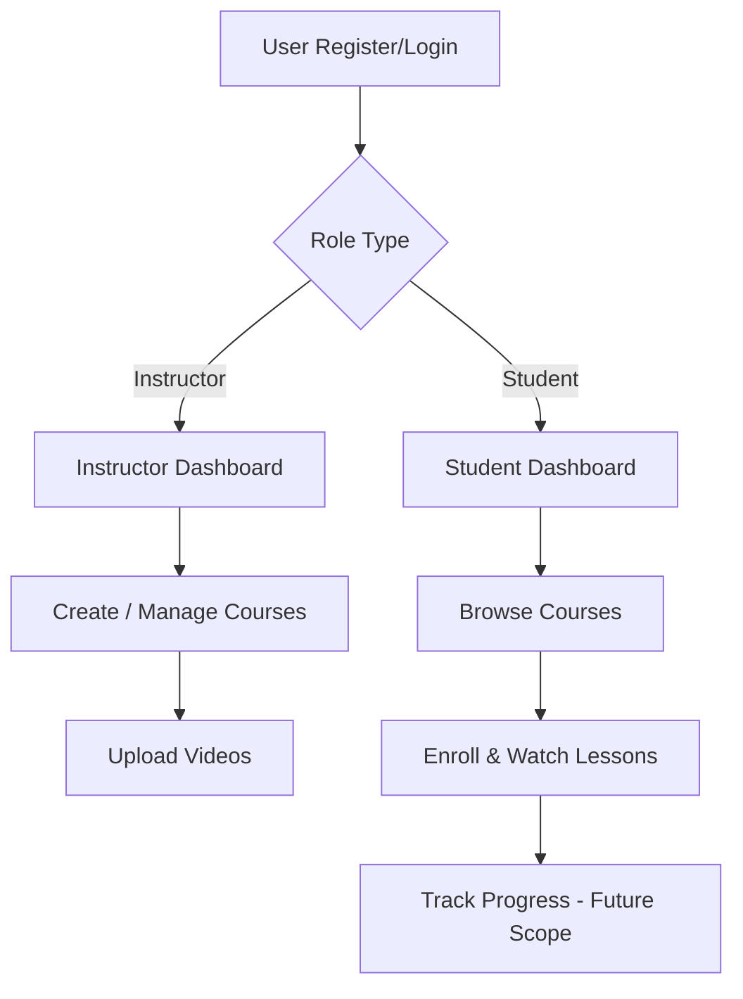
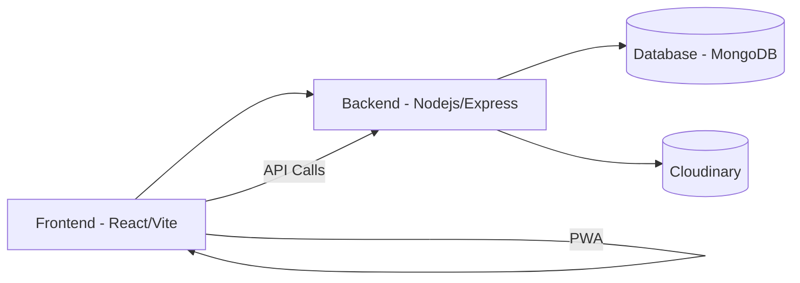
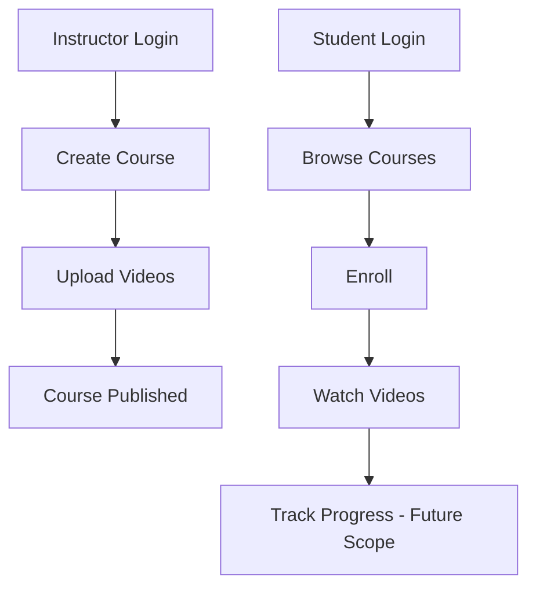

# **Functional Use Case - LearnX LMS**

## **1. Functional Overview**

- Secure login and registration (JWT)
- Role-based dashboards (Instructor / Student)
- Course creation, management, and enrollment
- Video upload & playback (Cloudinary)
- PWA-enabled for mobile access  

| **Module** | **Function** |
|-------------|--------------|
| **Authentication** | Secure login & registration |
| **Courses** | Create & manage course details |
| **Media** | Upload and stream videos |
| **Enrollment** | Students join courses |
| **Dashboard** | Role-based user views |
| **Progress Tracker** | Save learning progress *(future)* |

---

## **2. Functional Flow**

---

## **3. Use Case Summary**

| **ID** | **Use Case**     | **Action**                          |
| :----: | ---------------- | ----------------------------------- |
|   F1   | Register User    | Sign up as Instructor or Student    |
|   F2   | Login User       | Authenticate using JWT or Firebase  |
|   F3   | Create Course    | Instructor adds course with videos  |
|   F4   | Enroll in Course | Students join a course              |
|   F5   | Watch Videos     | Students stream lessons             |
|   F6   | Manage Course    | Instructor edits or deletes courses |

---

## **4. System Flow**

---

## **5. Edge Cases**

| **Scenario**             | **Expected Action**           |
| ------------------------ | ----------------------------- |
| Invalid login            | Show error message            |
| JWT expired              | Redirect to login             |
| Upload failed            | Retry or notify user          |
| Unauthorized role access | Redirect to dashboard         |
| Video not loading        | Retry or show fallback screen |

---

## **6. Quick Visual Summary**

