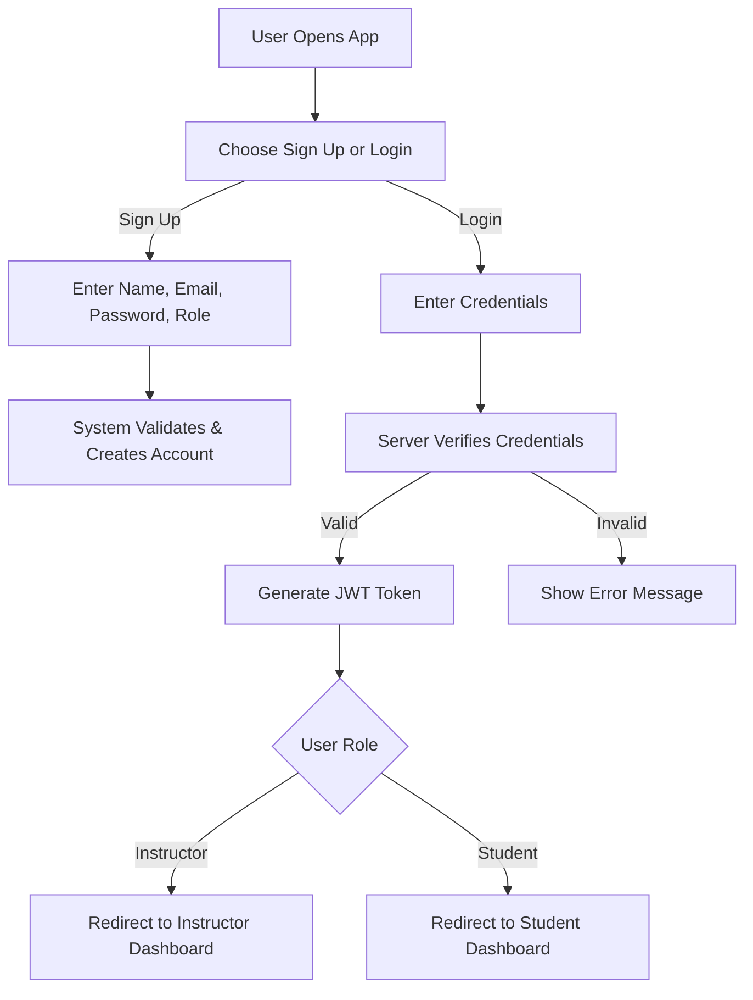
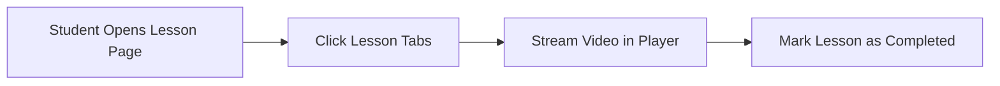
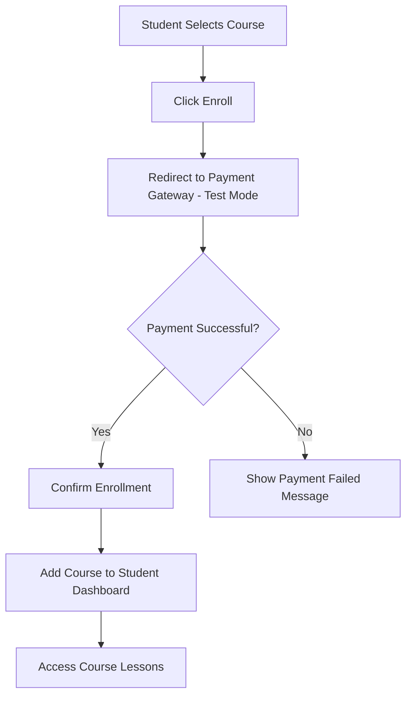
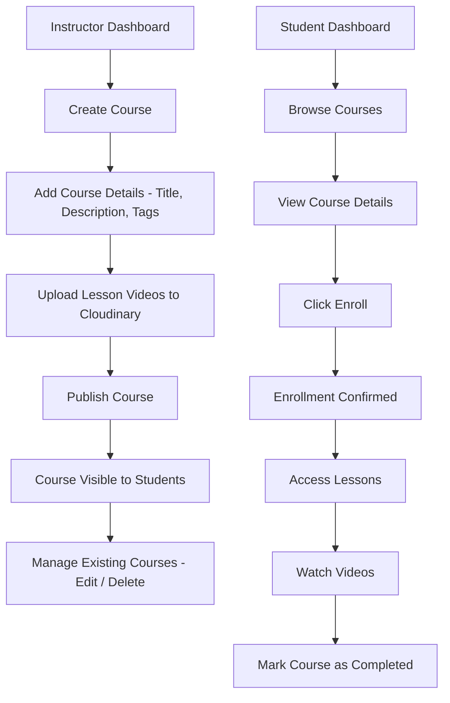
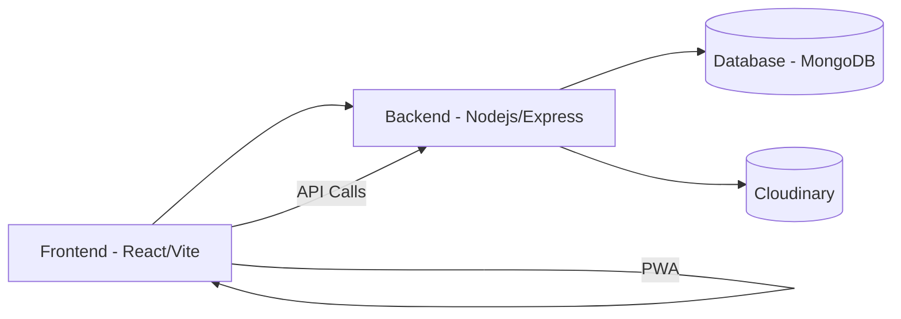

# **Functional Use Case - LearnX LMS**

## **1. Functional Overview**

- Secure login and registration (JWT)
- Role-based dashboards (Instructor / Student)
- Course creation, management, and enrollment
- Video upload & playback (Cloudinary)
- PWA-enabled for mobile access  

| **Module** | **Function** |
|-------------|--------------|
| **Authentication** | Secure login & registration |
| **Courses** | Create & manage course details |
| **Media** | Upload and stream videos |
| **Enrollment** | Students join courses |
| **Dashboard** | Role-based user views |

---

## **2. Functional Flow**

### **2.1 User Registration & Login**

Shows how users sign up or log in. After validation, a token is generated and they’re redirected to their dashboard based on role.

---

### **2.2 Video Playback Flow**

Students open a lesson and play the video directly from Cloudinary. Once the video is completed, they can mark the lesson as done to track progress.

---

### **2.3 Enrollment Flow**

Students select a course and proceed to the payment gateway. On successful payment, the course is added to their dashboard and they can start learning. If the payment fails, an error message is shown.

---

## **3. Core Functional Modules**

| **Module**            | **Functionality**                               |
| --------------------- | ----------------------------------------------- |
| **Authentication**    | Register and login securely using JWT           |
| **Authorization**     | Role-based dashboard redirection                |
| **Dashboard**         | Personalized interface for each user role       |
| **Course Management** | Instructors create, edit, and delete courses    |
| **Media Management**  | Upload and watch videos using Cloudinary       |
| **Enrollment**        | Students browse and enroll in courses           |

---

## **4. Instructor & Student Workflow**

Instructors create courses by adding details and uploading lesson videos to Cloudinary. Once published, these courses appear for students to browse and enroll. Students can join courses, access lessons, watch videos, and mark their progress as completed from their dashboard.

---

## **5. Use Case Summary**

| **ID** | **Use Case**     | **Action**                          |
| :----: | ---------------- | ----------------------------------- |
|   F1   | Register User    | Sign up as Instructor or Student    |
|   F2   | Login User       | Authenticate using JWT or Firebase  |
|   F3   | Create Course    | Instructor adds course with videos  |
|   F4   | Enroll in Course | Students join a course              |
|   F5   | Watch Videos     | Students stream lessons             |
|   F6   | Manage Course    | Instructor edits or deletes courses |

---

## **6. System Flow**

The React + Vite frontend interacts with the Node.js + Express backend via APIs. The backend connects to MongoDB for data storage and Cloudinary for media handling. The PWA setup ensures fast, responsive, user experience across devices.

---

## **7. Edge Case Handling**

| **Scenario**        | **Expected Behavior**              |
| ------------------- | ---------------------------------- |
| Invalid credentials | Show error message                 |
| JWT expired         | Redirect to login                  |
| Unauthorized access | Redirect to dashboard              |
| Upload failed       | Retry or notify user               |
| Video not loading   | Retry or show fallback             |
| Instructor deletes a course with enrolled students | Currently, the course is deleted but in the future, a soft delete or “inactive” status can be added to avoid data loss for students. |

--- 

## **8. Future Scope**

* **Progress Tracker:** Track lesson completion and learning analytics
* **Payment Integration:** Enable paid course enrollment
* **AI Recommendations:** Suggest courses based on learner behavior
* **Enhanced PWA:** Push notifications, offline playback, and sync
