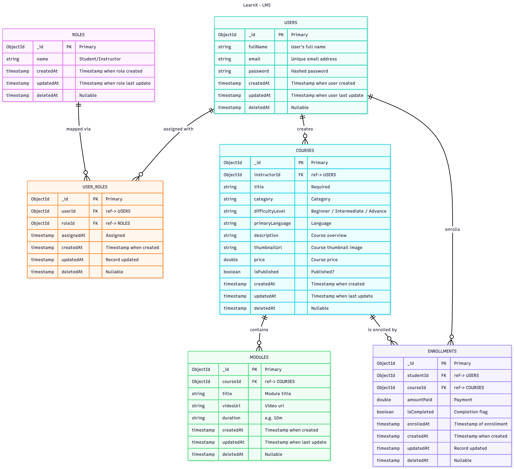

# **LearnX LMS - Database Schema**

## **1. Overview**

This schema defines the core data structure for **LearnX LMS**, including **Users, Roles, Courses, Modules, and Enrollments**.
It ensures relational integrity and supports the platform's main functionalities: authentication, course creation, media management, and enrollment tracking.

## **2. ER Diagram**

---

## **3. Collection Details**

| Collection      | Fields                                                 | Notes / Purpose                                         |
| --------------- | ------------------------------------------------------ | ------------------------------------------------------- |
| **USERS**       | `_id`, `name`, `email`, `password`, `timestamps`               | Unique email, hashed password, supports login & profile |
| **ROLES**       | `_id`, `name`, `timestamps`                                | Defines user roles (Instructor / Student)               |
| **USER_ROLES**  | `_id`, `userId`, `roleId`, `timestamps`                      | Links users with roles; many-to-many mapping            |
| **COURSES**     | `_id`, `title`, `description`, `instructorId`, `timestamps`    | Stores course details created by instructors            |
| **MODULES**     | `_id`, `title`, `courseId`, `videoUrl`, `duration`, `timestamps` | Lessons within a course  |
| **ENROLLMENTS** | `_id`, `studentId`, `courseId`, `status`, `timestamps`         | Tracks which students are enrolled in which courses     |

---

## **4. Indexing**

| Collection  | Field(s)            | Purpose                                          |
| ----------- | ------------------- | ------------------------------------------------ |
| USERS       | email               | Unique login; fast user search                   |
| USER_ROLES  | userId + roleId     | Prevent duplicate roles                          |
| COURSES     | instructorId        | Quickly fetch all courses by instructor          |
| ENROLLMENTS | studentId, courseId | Avoid duplicate enrollment; fast progress lookup |

---

## **5. Relationships**

* **Users ↔ Roles**: Many-to-many via `USER_ROLES`
* **Instructor ↔ Courses**: One-to-many
* **Course ↔ Modules**: One-to-many
* **Students ↔ Courses**: Many-to-many via `ENROLLMENTS`
