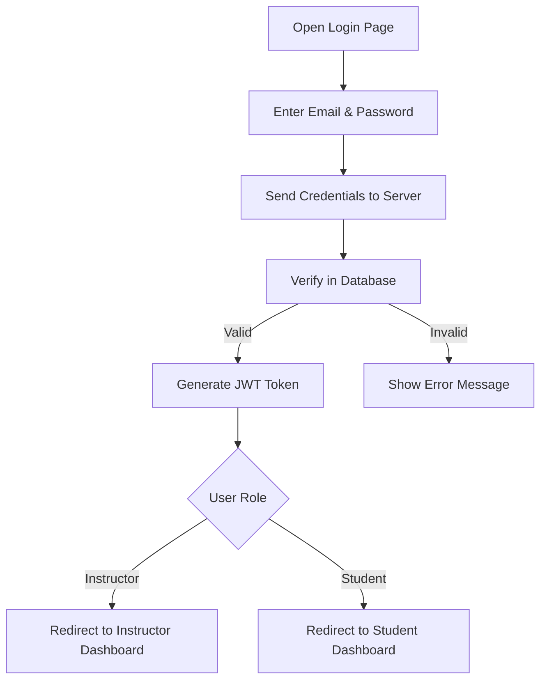
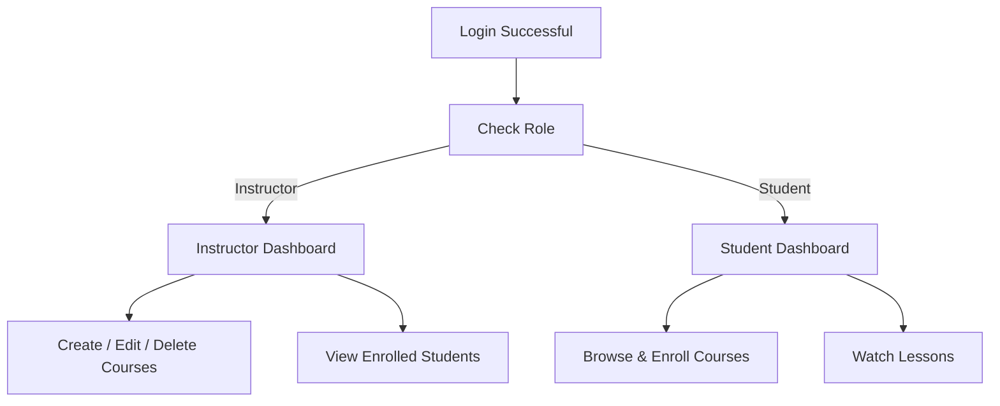

# **Technical Docs – LearnX LMS**

## **1. Authentication Flow**

Authentication ensures that only valid **Instructors** and **Students** can access LearnX.
Users log in or sign up using email and password.

**Purpose:**

* Secure user login
* Prevent unauthorized access

---

## **2. Authorization Flow**

---

## **3. Planned Tech Setup**

| **Layer** | **Technology** |
|-------------------------------------------------------------------|----------------|
| **Frontend** |  |
| **Backend** |  |
| **Database** |  |
| **Media Storage** |  |
| **Payment Integration (Test)** |  |
| **Authentication** |  |
| **Mobile App** | |

---

## **4. Conclusion**

**LearnX LMS** uses secure authentication and role-based authorization to provide:

* Clear separation of **Instructor** and **Student** views
* Safe and scalable system
* Ready for future features like progress tracking and payments

