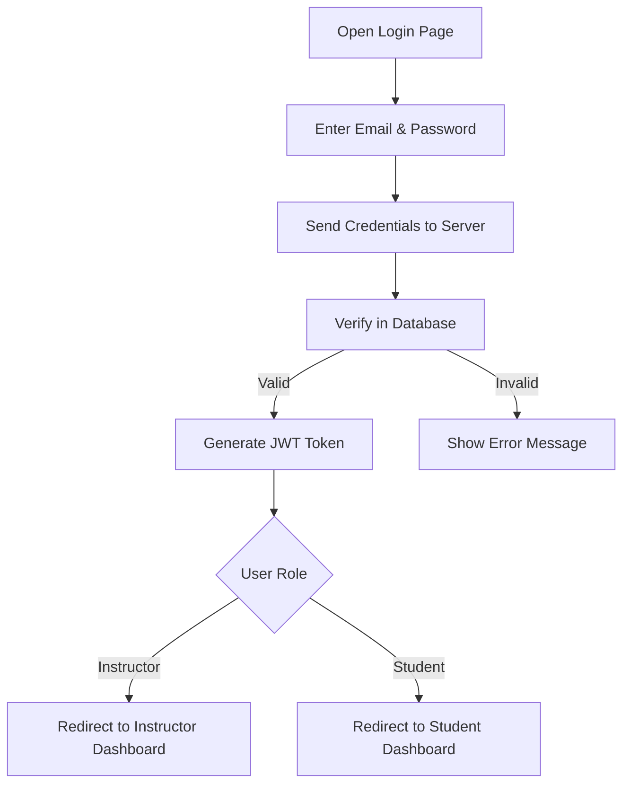
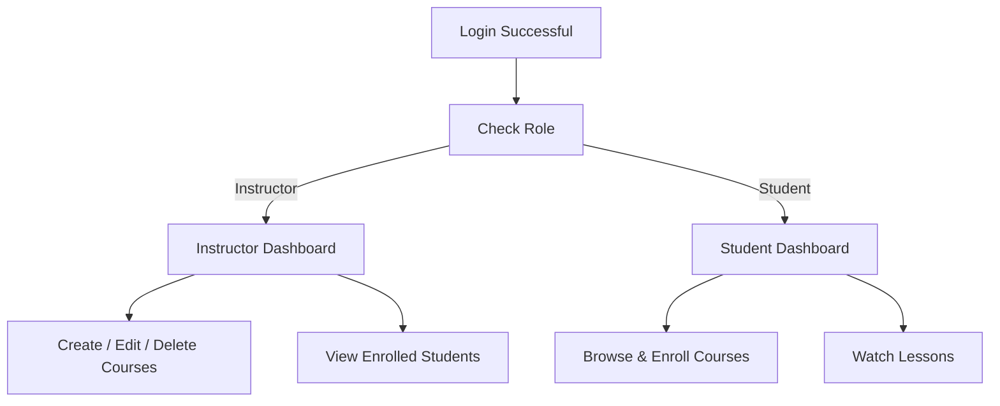

# **Technical Docs - LearnX LMS**

## **1. Architecture Overview (AWS)**

**LearnX** is a role-based Learning Management System (LMS) connecting **Instructors** and **Students** through a secure, scalable web platform.
It follows a modular **MERN stack architecture** for seamless integration and deployment.

## **2. Authentication Flow**

Authentication ensures that only valid **Instructors** and **Students** can access LearnX.
Users log in or sign up using email and password.

**Purpose:**

- Secure user login
- Prevent unauthorized access

---

## **3. Authorization Flow**

After login, the system checks the user’s role and grants access accordingly. Instructors can manage courses, while students can browse, enroll, and watch lessons.

---

## **4. Tech Stack**

| **Layer**                      | **Logo**                                                                                                                                                           | **Technology** | **Version** |
| ------------------------------ | ------------------------------------------------------------------------------------------------------------------------------------------------------------------ | -------------- | ----------- |
| **Programming Language**       |                                                                                          | JavaScript     | ES14        |
| **Frontend Library**           |                                                                                            | React          | 19.2.0      |
| **CSS Framework**              |                                                                                  | Tailwind CSS   | 4.1.17      |
| **Build Tool**                 |                                                                                              | Vite           | 7.2.2       |
| **Runtime Environment**        |                                                                                         | Node.js        | 22.12.0     |
| **Backend Framework**          |                                                                                        | Express        | 5.1.0       |
| **Database**                   |                                                                                        | MongoDB        | 8.0         |
| **Media Storage**              |  | Cloudinary     | 1.45.0      |
| **Payment Integration (Test)** |                                                                          | PayPal SDK     | 1.8.0       |
| **Authentication**             |                                                                        | JWT            | 9.0.2       |
| **Mobile Experience**          |                                                | React PWA      | Manifest V3 |
| **Cloud Hosting**              |                                                                                                | AWS            | Latest      |
| **Version Control**            |                                                                            | GitHub         | Latest      |

---

## **5. API Endpoints Reference**

### **I. Authentication Endpoints**

| **Endpoint**         | **Method** | **Description**               |
| -------------------- | ---------- | ----------------------------- |
| `/api/auth/register` | POST       | Create new user account       |
| `/api/auth/login`    | POST       | User login and JWT generation |
| `/api/auth/me`       | GET        | Get current user profile      |

### **II. User Endpoints**

| **Endpoint**         | **Method** | **Description**       |
| -------------------- | ---------- | --------------------- |
| `/api/users/profile` | GET        | Get user profile data |
| `/api/users/profile` | PUT        | Update user profile   |

### **III. Course Endpoints**

| **Endpoint**       | **Method** | **Description**                     |
| ------------------ | ---------- | ----------------------------------- |
| `/api/courses`     | GET        | Get all courses (public)            |
| `/api/courses`     | POST       | Create new course (instructor only) |
| `/api/courses/:id` | GET        | Get course details                  |
| `/api/courses/:id` | PUT        | Update course (instructor only)     |
| `/api/courses/:id` | DELETE     | Delete course (instructor only)     |

### **IV. Enrollment Endpoints**

| **Endpoint**             | **Method** | **Description**             |
| ------------------------ | ---------- | --------------------------- |
| `/api/enroll/:courseId`  | POST       | Enroll in course            |
| `/api/enroll/my-courses` | GET        | Get user's enrolled courses |

### **V. Module Endpoints**

| **Endpoint**               | **Method** | **Description**      |
| -------------------------- | ---------- | -------------------- |
| `/api/courses/:id/modules` | GET        | Get course modules   |
| `/api/courses/:id/modules` | POST       | Add module to course |
| `/api/modules/:id`         | PUT        | Update module        |
| `/api/modules/:id`         | DELETE     | Delete module        |

---

## **6. Conclusion**

**LearnX LMS** uses secure authentication and role-based authorization to provide:

- Clear separation of **Instructor** and **Student** views
- Safe and scalable system
- Ready for future features like progress tracking and payments
